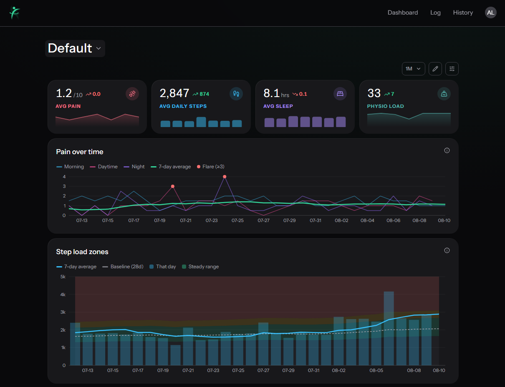

# PhysiMate

A web app for tracking physio rehab. You log pain, steps, sleep and prescribed
exercises each day, and it turns that into a dashboard that answers two
questions the raw numbers don't:

1. **Am I actually progressing?** — trends rather than day-to-day noise.
2. **What preceded that flare-up?** — how load relates to symptoms, including the
   next-day lag that tendon pain usually follows.

It was built to replace a spreadsheet used to track a tibialis posterior tendon
injury, but nothing in it is specific to that injury. Every account gets its own
private logs.



## Features

- **Daily logging** split into short steps (pain, activity, physio, notes) so it
  works on a phone, which is where most logging actually happens.
- **Customisable dashboards** — pick from 27 widgets, drag and resize them, and
  keep several dashboards with independent layouts. Desktop and mobile layouts
  are stored separately.
- **Derived metrics** including physio load, rolling pain trends, flare
  detection, next-day lag correlations, and both ACWR and EWMA workload ratios
  for spotting a training spike before it becomes a flare.
- **Spreadsheet import** for backfilling history from an existing `.xlsx`.
- **CSV export** over any date range.
- **A definitions page** at `/definitions` explaining every value the app shows,
  how it's collected, and the formula behind it — linked from each widget's
  tooltip.

## Tech stack

| | |
| --- | --- |
| Framework | Next.js 16 (App Router) + React 19 |
| Database | Neon Postgres via Drizzle ORM |
| Auth | Neon Auth (Better Auth, hosted) |
| UI | PrimeReact v11, CSS Modules |
| Charts | Recharts |
| Layout | react-grid-layout |
| Validation | Zod |
| Tests | Vitest |
| Hosting | Vercel |

## Getting started

### Prerequisites

- Node.js 20 or newer
- A [Neon](https://neon.tech) project with **Neon Auth** enabled (free tier is
  fine). Neon Auth provisions its own `neon_auth` schema in the same database —
  the app's tables foreign-key into it.

### Setup

```bash
git clone https://github.com/adub20018/physio-tracker.git
```

```bash
cd physio-tracker && npm install
```

Copy the environment template and fill it in:

```bash
cp .env.example .env.local
```

| Variable | Purpose |
| --- | --- |
| `DATABASE_URL` | Pooled Neon connection string, used for app queries |
| `DATABASE_URL_UNPOOLED` | Direct connection, required by drizzle-kit for migrations |
| `NEON_AUTH_BASE_URL` | Neon Auth endpoint for your project |
| `NEON_AUTH_COOKIE_SECRET` | Session cookie secret from Neon Auth |
| `NEXT_PUBLIC_PRIMEUI_LICENSE_KEY` | PrimeUI Community key (free for individuals). Optional — without it the app runs but logs a console warning |

All four Neon values come from the Neon dashboard once Auth is enabled. If the
project is linked to Vercel, `vercel env pull .env.local` fetches them instead of
copying by hand.

Run the migrations:

```bash
npm run db:migrate
```

Then start the dev server:

```bash
npm run dev
```

Open <http://localhost:3000>, sign up, and you'll land on an empty dashboard.
The Add widget dialog shows previews built from example data until you've logged
about two weeks, so it's usable before you have history. To get there faster,
import a spreadsheet from **Log → Import**, or just log a few days by hand.

## Scripts

| Command | Description |
| --- | --- |
| `npm run dev` | Dev server |
| `npm run build` | Production build |
| `npm start` | Serve a production build |
| `npm run lint` | ESLint |
| `npm test` | Run the unit tests once |
| `npm run test:watch` | Tests in watch mode |
| `npm run db:generate` | Generate a migration from schema changes |
| `npm run db:migrate` | Apply pending migrations |

## Project structure

```
src/
  app/            Next.js routes. Pages fetch via repositories, compute via
                  domain, render via components — no business logic here.
  auth/           getCurrentUser() and the Neon Auth instances. The only place
                  that knows how auth works.
  components/
    charts/       Chart components with props we define. Recharts is an
                  internal detail of this folder.
    ui/           PrimeReact composition and shared UI pieces.
    dashboard-builder/  Widget registry, grid, and the add-widget picker.
  db/             Drizzle schema, client, and migrations. Nothing outside this
                  folder imports Drizzle.
  domain/         Pure functions with zero dependencies: rolling averages,
                  physio load, flare detection, correlations, workload ratios.
  lib/            Shared helpers, plus the /definitions content.
  repositories/   Data access behind plain-TS interfaces, all scoped by userId.
```

Dependency direction is one-way: `app → components / domain / repositories → db`.
Nothing imports upward, and `domain/` imports nothing at all — which is what
keeps every derived metric unit-testable without a database or a browser.

## Adding a widget

Widgets are declared in `src/components/dashboard-builder/widget-registry.tsx`.
A new one needs an entry with its `type` (the key stored in the database), label,
default and minimum sizes, a tooltip `hint`, and a `render` function. If it shows
a value that isn't already documented, add it to `src/lib/definitions.ts` too and
point the widget's `definitionId` at it so the tooltip's "Read more" link
resolves.

## Documentation

- [PLAN.md](PLAN.md) — what's being built and why, including the data model.
- [WIDGET_DESCRIPTIONS.md](WIDGET_DESCRIPTIONS.md) — every widget and variable in
  one place.
- [AGENTS.md](AGENTS.md) — contribution conventions and hard-won library gotchas.
- `src/domain/README.md` — the rules the domain layer follows.

## Contributing

Branch per feature, one commit per self-contained change, and a PR into `main`.
`npm run lint` and `npm run build` must both pass first, and UI changes should be
checked at mobile width — daily logging happens on a phone.

## A note on the numbers

This is a personal tracking tool, not a medical device. The workload thresholds
it draws come from team-sport research and have never been validated for an
individual's rehab. Treat anything it flags as a prompt to look more closely, and
talk to your physio before letting it steer decisions.
